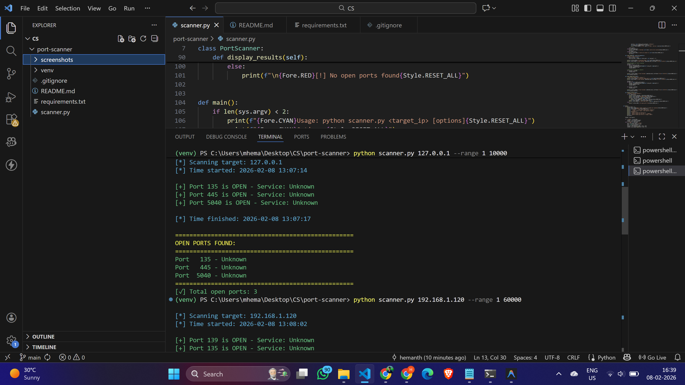
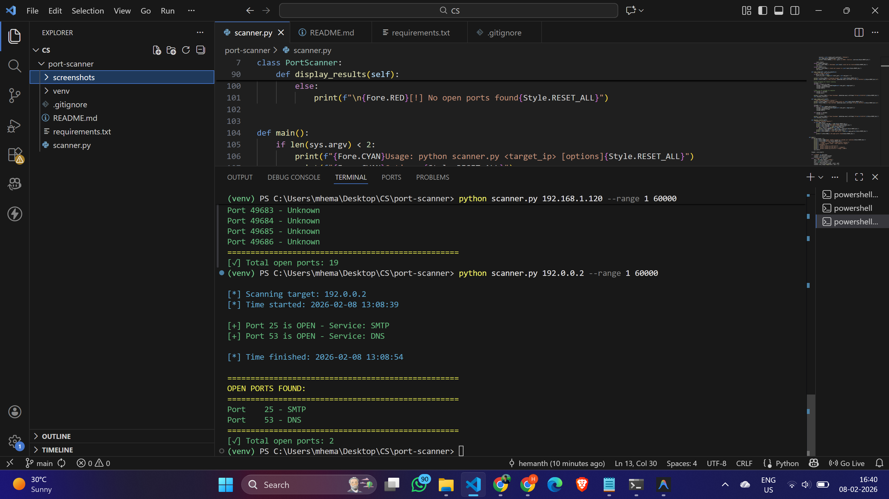

# Port Scanner - Network Security Tool

A Python-based port scanner to identify open ports and running services on target systems.

## Features
- Scan single or multiple ports
- Identify common services running on ports
- Multi-threaded scanning for speed
- Color-coded output
- Scan common ports only (faster option)
- Custom port range scanning

## Installation

### Prerequisites
- Python 3.7+
- pip

### Setup
```bash
git clone <your-repo-url>
cd port-scanner
python -m venv venv
source venv/bin/activate  # On Windows: venv\Scripts\activate
pip install -r requirements.txt
```

## Usage

### Scan all ports
```bash
python scanner.py 127.0.0.1
```

### Scan common ports only (faster)
```bash
python scanner.py 192.168.1.1 --common
```

### Scan specific port range
```bash
python scanner.py 10.0.0.5 --range 1 1000
```

## How It Works

1. **Socket Connection**: Uses Python's socket library to attempt TCP connections
2. **Port Detection**: Tries connecting to each port; if connection succeeds, port is open
3. **Service Identification**: Maps port numbers to known services (HTTP=80, HTTPS=443, etc.)
4. **Threading**: Uses multiple threads to scan ports simultaneously for speed

## Port Ranges
- Well-known ports: 0-1023 (HTTP, HTTPS, DNS, SSH)
- Registered ports: 1024-49151 (Application-specific)
- Dynamic ports: 49152-65535 (Temporary/private)

## Common Ports Scanned
- 20, 21: FTP
- 22: SSH
- 25: SMTP
- 53: DNS
- 80: HTTP
- 443: HTTPS
- 3306: MySQL
- 5432: PostgreSQL
- 27017: MongoDB
- 3389: RDP

## Legal Notice
⚠️ Only scan systems you own or have permission to scan. Unauthorized port scanning may be illegal.

## Technologies Used
- Python 3
- Socket programming
- Threading
- Colorama (colored output)

## Author
Hemanth M


## Screenshots

### Localhost Scan (Open Ports Detected)


### Full Network Port Scan


### SMTP and DNS Ports Detected

